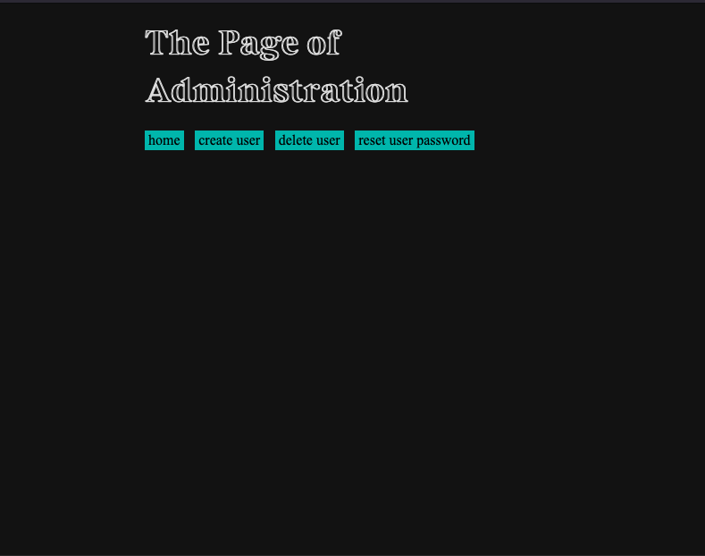

# socialmedia

<b>socialmedia</b> is a simple social media platform I made for me and my friends.

## What it is and isn't
__socialmedia__ is a simple social media platform. It's not a one-size-fits-all or the ultimate solution to social software, but, as is, it works pretty well for me and my friends, and should be fairly easy for someone with a little bit of technical know-how to adapt to their needs. I recommend keeping the number of users down to like [less than 30 users](https://en.wikipedia.org/wiki/Dunbar's_number).

The backend is standard library Go except for the [postgres driver](https://github.com/lib/pq), and the [bcrypt package](https://pkg.go.dev/golang.org/x/crypto/bcrypt). I'm also using [Postgres](https://hub.docker.com/_/postgres) for the database. The frontend is just HTML/CSS and vanilla javascript. It's a fairly snappy app and there's not really any unmanageable dependencies. There's also an NGINX reverse proxy sitting in front of the server to handle enforcing HTTPS by default, and taking care of rate limiting.

The goal is to keep things as simple as they can get, so it's easy to maintain and extend/modify as needed.

## Design
The core principle of __socialmedia__ is that social software should be a tool to help people connect. I believe that people are already pretty good at this, so creating the simplest system that allows people to do that intuitively is the best way to go. For me, that simplest system has no followers, likes, or notifications, just friends making posts on a website. And if you think the simplest system is different, feel free to fork!

___Q: Why no followers?___  
A: Assuming you have a [small user base](https://en.wikipedia.org/wiki/Dunbar's_number), followers are unnecessary. If everyone can see everyone's posts, natural social norms kick in, and you don't have to develop spam filters or deputize moderators, because everyone on the site is a moderator.

___Q: Why no notifications?___  
A: So that getting a reply feels like getting a letter in the mailbox. You only notice it's there when you check, and when you do, it's way better than because some red bubble told you someone liked your post. The dopamine hit doesn't come from a number, it comes from intentional interaction. I think this makes it a better platform to use.

> __Aside__  
> People having been talking about social software for a while. [This article from 2003](https://web.archive.org/web/20030713130936/http://www.shirky.com/writings/group_enemy.html) inspired a lot of the design for __socialmedia__. I definitely recommend giving it a read. And while I think you should take them with a grain of salt, the wikipedia articles on [social software](https://en.wikipedia.org/wiki/Social_software) and [online communities](https://en.wikipedia.org/wiki/Online_community) are really interesting, too.

As far as the UI goes, I knew I wanted a "retro" design while still being user-friendly, which may seem like an oxymoron. I think I did a pretty good job of balancing the two, but I'll leave that for you to decide. And if you don't like it, feel free to fork off.

## How to use it

It's a pretty simple app. There are two types of user, `admin` and `not-admin`. In the beginning there is just one user: _admin_. 

Because _admin_ is part of the `admin` group, they can create new users (including other `admin` users), delete users, and reset user passwords. 

Once _admin_ creates a new user, the user's password is automatically generated for _admin_ to provide to the new user. It's not a super secure password, so I recommend that the new user change it once they log in. 

Also, note that once a user's username has been chosen, it can't be changed. If they want a new identity, _admin_ will have to make them a new account and delete the old one (don't worry, posts from deleted accounts remain behind). 

 > Notice that there is no sign up page. You literally have to already know somebody on the site to actually join.

### Homepage  
Once a user has logged in, they will see the homepage. This page contains the top 10 most recent posts, a "show earlier posts button", and a navbar. 

This navbar has four buttons:
1. __new post__: allows the user to make a new post
2. __profile__: allows the user to modify their profile page
3. __help__: answers some basic user questions
4. __log out__: logs the user out

You'll also notice that individual posts have __delete__ buttons if the user owns the post, and a __reply__ button for all users. These buttons act how you may expect.

### Profile page
Let's look at an example profile page.  

There are five buttons on this page:
1. __home__: takes the user back to the homepage
2. __change password__: allows the user to change their password to something ___not___ in [the 2020 list of top 100 passwords](https://github.com/danielmiessler/SecLists/blob/master/Passwords/Common-Credentials/10-million-password-list-top-100.txt)
3. __change bio__: allows the user to change their bio 
4. __change profile picture__: allows the user to change their profile picture
5. __admin__ _(visible to `admin` users only)_: takes the user to the admin page 

### Admin page
The admin page is where admins can perform administrative functions. 

This page has four buttons: 
1. __home__: takes the user back to the home page
2. __create user__: allows the admin to create a new user
3. __delete user__: deletes the user from the site, but does ___not___ remove their posts 
4. __reset user password__: allows the admin to generate a new password for the user

## More Documentation
See [docs](./docs) for more information.

## Contributing

If you see something that you think could be improved, make an issue/submit a PR.  I'd love to hear your feedback!

## Bugs

There is a known bug where if there's more than 20 top-level replies on a post, it only shows the top 20. This isn't really an issue for me or my friends, but if you want to fix it feel free. 

